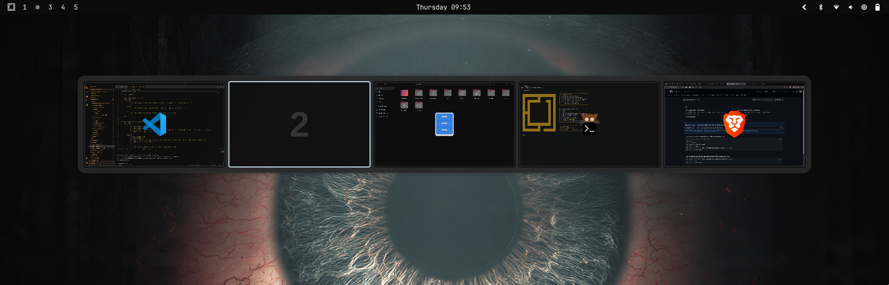
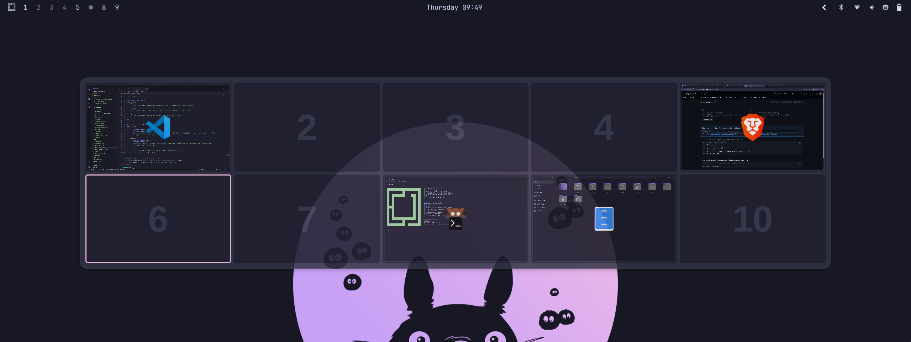
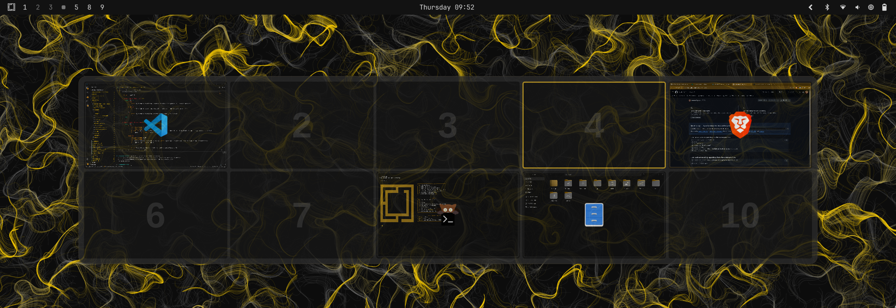

<div align="center">

  

# omarchy-qs

**Workspace overview for [Omarchy](https://github.com/basecamp/omarchy) — powered by Quickshell.**

</div>

Press `Super+D` to get a bird's-eye view of all your workspaces. Click any workspace to jump to it, or drag windows between workspaces directly from the overview. The palette updates automatically whenever you change your Omarchy theme.

## Requirements

- [Omarchy](https://github.com/basecamp/omarchy)
- [Quickshell](https://quickshell.outfoxxed.me/) — installed automatically if missing on:

| Distro | Arch |
|--------|------|
| Arch Linux | x86\_64, ARM |
| Fedora | x86\_64, ARM |

## Install

```bash
git clone https://github.com/eightscrow/omarchy-qs.git
cd omarchy-qs
bash install.sh
```

## Keybinding

| Key | Action |
|-----|--------|
| `Super+D` | Toggle overview |
| `Escape` / `Enter` | Close overview |
| Arrow keys / `hjkl` | Navigate workspaces |
| `1`–`9` | Jump to workspace |
| Click | Switch to workspace |
| Drag | Move window to workspace |

## Uninstall

```bash
bash uninstall.sh
```
